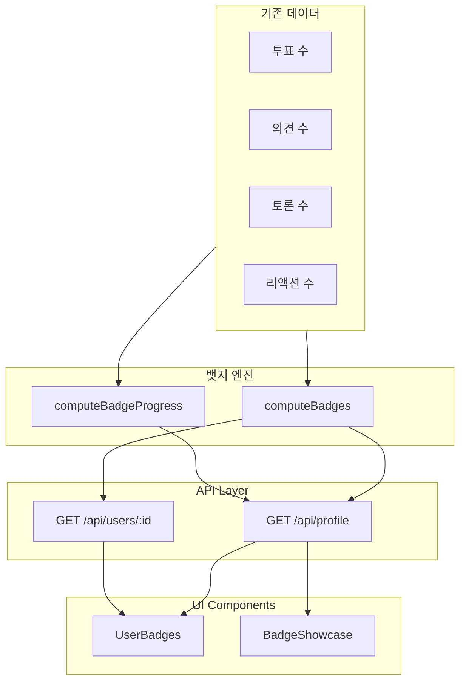

# 뱃지 시스템 (Badge System)

## 개요

BothSides 플랫폼의 뱃지 시스템은 사용자의 활동을 시각적으로 표현하고 참여를 유도하는 게이미피케이션 기능입니다. 사용자의 투표, 의견 작성, 토론 개설, 리액션 등의 활동을 추적하여 자동으로 뱃지를 부여합니다.

## 특징

- **DB 스키마 변경 없음**: 기존 활동 데이터로 실시간 계산
- **5개 카테고리**: 투표, 의견, 토론, 참여, 종합 활동
- **14개 뱃지**: Bronze → Silver → Gold → Platinum 티어 시스템
- **진행률 추적**: 다음 뱃지까지의 진행률 표시
- **반응형 디자인**: 모바일/데스크톱 최적화
- **토스증권 스타일**: 그라데이션 색상의 현대적인 디자인

## 뱃지 목록

### 1. 투표 활동 (Voting)

| 뱃지 | 조건 | 티어 | 아이콘 |
|------|------|------|--------|
| 첫 투표 | 1개 이상 투표 | Bronze | 🗳️ |
| 투표러 | 10개 이상 투표 | Silver | ✅ |
| 투표 매니아 | 50개 이상 투표 | Gold | 🎯 |
| 투표왕 | 100개 이상 투표 | Platinum | 👑 |

### 2. 의견 작성 (Opinion)

| 뱃지 | 조건 | 티어 | 아이콘 |
|------|------|------|--------|
| 첫 한마디 | 1개 이상 의견 | Bronze | 💬 |
| 논객 | 10개 이상 의견 | Silver | 🎤 |
| 토론왕 | 50개 이상 의견 | Gold | 🏆 |
| 설득의 달인 | 100개 이상 의견 | Platinum | 🎓 |

### 3. 토론 개설 (Topic)

| 뱃지 | 조건 | 티어 | 아이콘 |
|------|------|------|--------|
| 첫 토론 개설 | 1개 이상 토론 | Bronze | 📝 |
| 이슈 메이커 | 5개 이상 토론 | Silver | 📢 |
| 트렌드세터 | 20개 이상 토론 | Gold | 🌟 |

### 4. 커뮤니티 참여 (Engagement)

| 뱃지 | 조건 | 티어 | 아이콘 |
|------|------|------|--------|
| 리액션 요정 | 10개 이상 리액션 | Silver | ✨ |
| 공감왕 | 50개 이상 리액션 | Gold | ❤️ |

### 5. 종합 활동 (All-Around)

| 뱃지 | 조건 | 티어 | 아이콘 |
|------|------|------|--------|
| 올라운더 | 투표 1개 + 의견 1개 + 토론 1개 + 리액션 1개 | Gold | 🎖️ |

## 아키텍처



## 파일 구조

```
src/
├── lib/
│   └── badges.ts                    # 뱃지 엔진 (정의, 계산 로직)
├── components/
│   └── badges/
│       ├── UserBadges.tsx           # 뱃지 표시 컴포넌트
│       └── BadgeShowcase.tsx        # 전체 뱃지 쇼케이스
├── app/
│   ├── api/
│   │   ├── profile/route.ts         # 내 프로필 API
│   │   └── users/[id]/route.ts      # 공개 프로필 API
│   ├── profile/page.tsx             # 내 프로필 페이지
│   └── users/[id]/page.tsx          # 공개 프로필 페이지
└── components/ui/
    └── progress.tsx                 # 진행률 바 컴포넌트
```

## 핵심 함수

### `computeBadges(stats: UserActivityStats): EarnedBadge[]`

사용자의 활동 통계를 받아 획득한 뱃지 목록을 반환합니다.

**Parameters:**
```typescript
interface UserActivityStats {
  votesCount: number;
  opinionsCount: number;
  topicsCount: number;
  reactionsCount: number;
}
```

**Returns:**
```typescript
interface EarnedBadge {
  id: string;
  name: string;
  description: string;
  icon: string;
  category: BadgeCategory;
  tier: BadgeTier;
}
```

**Example:**
```typescript
const stats = {
  votesCount: 15,
  opinionsCount: 5,
  topicsCount: 2,
  reactionsCount: 8
};

const badges = computeBadges(stats);
// Returns: [첫 투표, 투표러, 첫 한마디, 첫 토론 개설]
```

### `computeBadgeProgress(stats: UserActivityStats): BadgeProgress[]`

모든 뱃지에 대한 진행률을 계산합니다 (획득/미획득 모두 포함).

**Returns:**
```typescript
interface BadgeProgress extends EarnedBadge {
  earned: boolean;
  progress: {
    current: number;
    target: number;
    percentage: number;
  };
}
```

**Example:**
```typescript
const progress = computeBadgeProgress(stats);
// Returns all badges with progress info:
// [
//   { id: "first-vote", earned: true, progress: { current: 15, target: 1, percentage: 100 } },
//   { id: "voter", earned: true, progress: { current: 15, target: 10, percentage: 100 } },
//   { id: "vote-enthusiast", earned: false, progress: { current: 15, target: 50, percentage: 30 } },
//   ...
// ]
```

### `getNextBadge(stats: UserActivityStats): BadgeProgress | null`

다음 획득 가능한 뱃지를 반환합니다 (진행률이 가장 높은 미획득 뱃지).

**Example:**
```typescript
const nextBadge = getNextBadge(stats);
// Returns: { id: "vote-enthusiast", ..., progress: { percentage: 30 } }
```

### `getBadgeTierColors(tier: BadgeTier): TierColors`

뱃지 티어에 맞는 Tailwind 색상 클래스를 반환합니다.

**Returns:**
```typescript
interface TierColors {
  bg: string;        // 배경 그라데이션
  text: string;      // 텍스트 색상
  border: string;    // 테두리 색상
}
```

**Example:**
```typescript
const colors = getBadgeTierColors(BadgeTier.GOLD);
// Returns: {
//   bg: "bg-gradient-to-r from-amber-400 to-yellow-500",
//   text: "text-amber-900 dark:text-amber-950",
//   border: "border-amber-400"
// }
```

## 컴포넌트 사용법

### UserBadges

사용자가 획득한 뱃지를 표시하는 컴포넌트입니다.

```tsx
import { UserBadges } from "@/components/badges/UserBadges";

<UserBadges 
  badges={earnedBadges}
  maxDisplay={4}      // 최대 표시 개수 (기본: 4)
  compact={true}      // 컴팩트 모드 (기본: true)
  className="mt-4"
/>
```

**Props:**
- `badges: EarnedBadge[]` - 획득한 뱃지 목록
- `maxDisplay?: number` - 최대 표시 개수 (초과시 "+N" 표시)
- `compact?: boolean` - 컴팩트 모드 여부
- `className?: string` - 추가 CSS 클래스

**Features:**
- Tooltip으로 뱃지 설명 표시
- Hover 시 확대 효과
- 티어별 그라데이션 색상
- 다크모드 지원

### BadgeShowcase

전체 뱃지 목록을 모달로 표시하는 컴포넌트입니다.

```tsx
import { BadgeShowcase } from "@/components/badges/BadgeShowcase";

<BadgeShowcase 
  stats={{
    votesCount: 15,
    opinionsCount: 5,
    topicsCount: 2,
    reactionsCount: 8
  }}
  trigger={<Button>전체 뱃지 보기</Button>}  // 선택사항
/>
```

**Props:**
- `stats: UserActivityStats` - 사용자 활동 통계
- `trigger?: React.ReactNode` - 모달을 여는 커스텀 트리거 (선택사항)

**Features:**
- 카테고리별로 그룹화된 뱃지 목록
- 획득한 뱃지: 풀 컬러 + 체크 마크
- 미획득 뱃지: 흐림 + 자물쇠 아이콘
- 진행률 바 + 동기부여 메시지
- 반응형 그리드 레이아웃 (모바일 1열, 데스크톱 2열)

## API 응답 형식

### GET /api/profile (내 프로필)

```json
{
  "data": {
    "votes": [...],
    "opinions": [...],
    "topics": [...],
    "votesCount": 15,
    "opinionsCount": 5,
    "topicsCount": 2,
    "reactionsCount": 8,
    "badges": [
      {
        "id": "first-vote",
        "name": "첫 투표",
        "description": "첫 번째 투표를 완료했습니다",
        "icon": "🗳️",
        "category": "VOTING",
        "tier": "BRONZE"
      },
      ...
    ],
    "badgeProgress": [
      {
        "id": "first-vote",
        "name": "첫 투표",
        "description": "첫 번째 투표를 완료했습니다",
        "icon": "🗳️",
        "category": "VOTING",
        "tier": "BRONZE",
        "earned": true,
        "progress": {
          "current": 15,
          "target": 1,
          "percentage": 100
        }
      },
      ...
    ]
  }
}
```

### GET /api/users/:id (공개 프로필)

```json
{
  "data": {
    "user": { ... },
    "votes": [...],
    "opinions": [...],
    "topics": [...],
    "reactions": [...],
    "votesCount": 10,
    "opinionsCount": 3,
    "topicsCount": 1,
    "reactionsCount": 5,
    "badges": [
      {
        "id": "voter",
        "name": "투표러",
        "description": "10개 이상의 토론에 투표했습니다",
        "icon": "✅",
        "category": "VOTING",
        "tier": "SILVER"
      },
      ...
    ]
  }
}
```

## 디자인 가이드

### 티어 색상

```typescript
// Platinum (최고 등급)
bg: "bg-gradient-to-r from-cyan-500 to-blue-500"
text: "text-white"
border: "border-cyan-400"

// Gold (고급)
bg: "bg-gradient-to-r from-amber-400 to-yellow-500"
text: "text-amber-900 dark:text-amber-950"
border: "border-amber-400"

// Silver (중급)
bg: "bg-gradient-to-r from-slate-300 to-slate-400"
text: "text-slate-900"
border: "border-slate-400"

// Bronze (기본)
bg: "bg-gradient-to-r from-orange-500 to-orange-600"
text: "text-white"
border: "border-orange-500"
```

### 반응형 디자인

```tsx
// 프로필 헤더에서의 뱃지 표시
<div className="flex flex-wrap items-center gap-2">
  <UserBadges badges={badges} maxDisplay={4} />
  <BadgeShowcase stats={stats} />
</div>

// 모바일: 가로 스크롤 또는 줄바꿈
// 데스크톱: 한 줄에 표시
```

### 접근성

- **Tooltip**: 뱃지에 마우스를 올리면 상세 설명 표시
- **Aria Labels**: 스크린 리더를 위한 적절한 라벨
- **키보드 내비게이션**: Tab 키로 모든 요소 접근 가능
- **색상 대비**: WCAG AA 기준 충족

## 성능 최적화

### 계산 방식

뱃지는 요청 시마다 실시간으로 계산되지만, 매우 빠릅니다:

```typescript
// O(n) complexity where n = number of badge definitions (14)
export function computeBadges(stats: UserActivityStats): EarnedBadge[] {
  return BADGE_DEFINITIONS.filter((badge) => badge.requirement(stats))
    .map(badge => ({ ...badge }));
}
```

### 캐싱 전략

**클라이언트 측:**
- SWR을 통한 자동 캐싱 및 재검증
- 프로필 페이지: `/api/profile` 엔드포인트 캐시
- 공개 프로필: `/api/users/:id` 엔드포인트 캐시

**서버 측:**
- 활동 카운트는 이미 인덱싱된 데이터베이스 쿼리
- Promise.all()로 병렬 쿼리 실행

### 데이터베이스 쿼리

```typescript
// 기존 활동 카운트 쿼리 (인덱싱됨)
const [votesCount, opinionsCount, topicsCount, reactionsCount] = await Promise.all([
  prisma.vote.count({ where: { userId: user.id } }),
  prisma.opinion.count({ where: { userId: user.id } }),
  prisma.topic.count({ where: { authorId: user.id } }),
  prisma.reaction.count({ where: { userId: user.id } }),
]);

// 뱃지 계산 (메모리 내 연산, 매우 빠름)
const badges = computeBadges({ votesCount, opinionsCount, topicsCount, reactionsCount });
```

## 확장 가이드

### 새로운 뱃지 추가

`src/lib/badges.ts`의 `BADGE_DEFINITIONS` 배열에 새 뱃지를 추가합니다:

```typescript
{
  id: "super-voter",              // 고유 ID
  name: "슈퍼 투표러",             // 표시 이름
  description: "500개 이상의 토론에 투표했습니다",
  icon: "⭐",                      // 이모지 아이콘
  category: BadgeCategory.VOTING, // 카테고리
  tier: BadgeTier.PLATINUM,       // 티어
  requirement: (stats) => stats.votesCount >= 500,  // 획득 조건
  progress: (stats) => ({ current: stats.votesCount, target: 500 }),
}
```

### 새로운 카테고리 추가

1. `BadgeCategory` enum에 새 카테고리 추가:
```typescript
export enum BadgeCategory {
  VOTING = "VOTING",
  OPINION = "OPINION",
  TOPIC = "TOPIC",
  ENGAGEMENT = "ENGAGEMENT",
  ALL_AROUND = "ALL_AROUND",
  NEW_CATEGORY = "NEW_CATEGORY",  // 새 카테고리
}
```

2. `BadgeShowcase.tsx`의 `CATEGORY_LABELS`에 라벨 추가:
```typescript
const CATEGORY_LABELS: Record<BadgeCategory, string> = {
  ...
  [BadgeCategory.NEW_CATEGORY]: "새 카테고리명",
};
```

3. `UserActivityStats` 인터페이스에 필요한 필드 추가

### 커스텀 티어 추가

`BadgeTier` enum과 `getBadgeTierColors` 함수를 수정합니다:

```typescript
export enum BadgeTier {
  BRONZE = "BRONZE",
  SILVER = "SILVER",
  GOLD = "GOLD",
  PLATINUM = "PLATINUM",
  DIAMOND = "DIAMOND",  // 새 티어
}

export function getBadgeTierColors(tier: BadgeTier): TierColors {
  switch (tier) {
    // ... 기존 케이스들
    case BadgeTier.DIAMOND:
      return {
        bg: "bg-gradient-to-r from-purple-500 to-pink-500",
        text: "text-white",
        border: "border-purple-400",
      };
    // ...
  }
}
```

## 테스트

### 단위 테스트 예시

```typescript
describe("Badge System", () => {
  it("should award first vote badge", () => {
    const stats = { votesCount: 1, opinionsCount: 0, topicsCount: 0, reactionsCount: 0 };
    const badges = computeBadges(stats);
    expect(badges).toContainEqual(expect.objectContaining({ id: "first-vote" }));
  });

  it("should calculate progress correctly", () => {
    const stats = { votesCount: 25, opinionsCount: 0, topicsCount: 0, reactionsCount: 0 };
    const progress = computeBadgeProgress(stats);
    const voteEnthusiast = progress.find(b => b.id === "vote-enthusiast");
    expect(voteEnthusiast?.progress.percentage).toBe(50); // 25/50 = 50%
  });

  it("should award all-rounder badge", () => {
    const stats = { votesCount: 1, opinionsCount: 1, topicsCount: 1, reactionsCount: 1 };
    const badges = computeBadges(stats);
    expect(badges).toContainEqual(expect.objectContaining({ id: "all-rounder" }));
  });
});
```

### 수동 테스트

1. **기본 뱃지 획득**
   - 투표, 의견, 토론 개설 후 프로필 확인
   - 뱃지가 표시되는지 확인

2. **진행률 확인**
   - "전체 뱃지 보기" 클릭
   - 미획득 뱃지의 진행률 바 확인
   - 동기부여 메시지 확인

3. **반응형 테스트**
   - 모바일 (375px): 뱃지가 줄바꿈되는지 확인
   - 태블릿 (768px): 레이아웃 전환 확인
   - 데스크톱 (1440px): 모든 뱃지가 잘 보이는지 확인

4. **다크모드 테스트**
   - 라이트/다크 모드 전환
   - 뱃지 색상이 적절한지 확인
   - 텍스트 가독성 확인

## 트러블슈팅

### 뱃지가 표시되지 않음

**원인:** API 응답에 badges 필드가 없음

**해결:**
```typescript
// API 응답 확인
console.log(profileData?.data?.badges);

// 없다면 computeBadges 함수 호출 확인
const badges = computeBadges(stats);
```

### 진행률이 100% 넘음

**원인:** current > target인 경우 처리 누락

**해결:**
```typescript
const percentage = Math.min(100, Math.floor((current / target) * 100));
```

### 뱃지 색상이 이상함

**원인:** Tailwind 클래스가 빌드에 포함되지 않음

**해결:**
- `tailwind.config.js`에서 경로 확인
- 동적 클래스 생성 대신 정적 클래스 사용
- `getBadgeTierColors` 함수 사용

### 모바일에서 레이아웃 깨짐

**원인:** 반응형 클래스 누락

**해결:**
```tsx
// 잘못된 예
<div className="flex">

// 올바른 예
<div className="flex flex-col sm:flex-row">
```

## 향후 개선 사항

### Phase 2 (고려 중)

- [ ] 뱃지 애니메이션 (획득 시 축하 효과)
- [ ] 뱃지 알림 (새 뱃지 획득 시 토스트)
- [ ] 뱃지 공유 (SNS 공유 기능)
- [ ] 히든 뱃지 (특별 조건으로 획득)
- [ ] 시즌 뱃지 (기간 한정 이벤트)

### Phase 3 (미래)

- [ ] 뱃지 레벨 시스템 (동일 뱃지의 단계별 업그레이드)
- [ ] 뱃지 조합 보너스 (특정 뱃지 세트 획득 시 보너스)
- [ ] 리더보드 (뱃지 순위)
- [ ] 뱃지 기반 권한 (특정 뱃지 보유자 전용 기능)

## 참고 자료

- [Radix UI Tooltip](https://www.radix-ui.com/docs/primitives/components/tooltip)
- [Radix UI Dialog](https://www.radix-ui.com/docs/primitives/components/dialog)
- [Radix UI Progress](https://www.radix-ui.com/docs/primitives/components/progress)
- [Tailwind CSS Gradients](https://tailwindcss.com/docs/gradient-color-stops)
- [토스 디자인 시스템](https://toss.im/design)

## 기여자

- 초기 설계 및 구현: 2026-02-07

## 라이선스

이 기능은 BothSides 프로젝트의 일부이며, 프로젝트 라이선스를 따릅니다.
